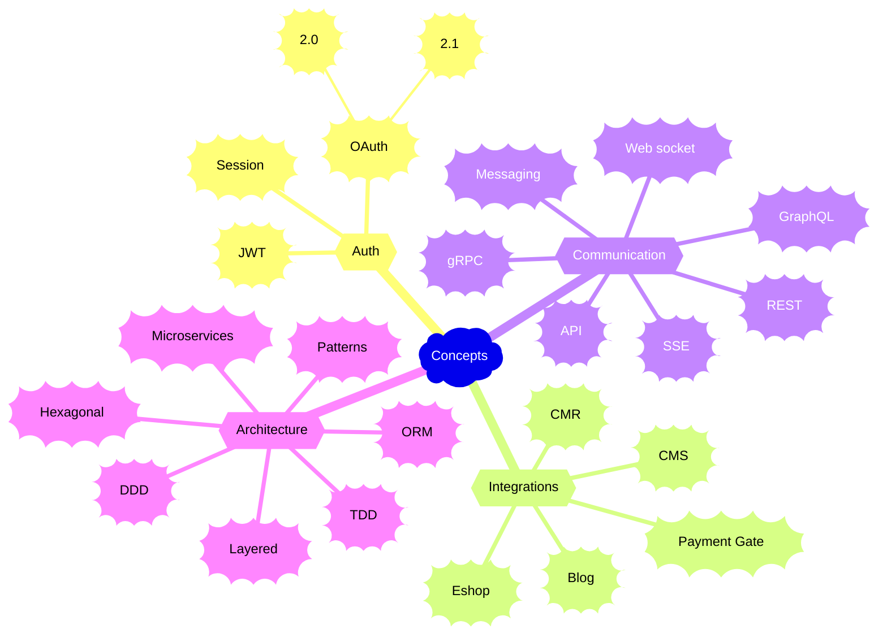

[< Back to profile](../README.md)

---

# Concepts

Programming concepts, integrations and patterns I've worked with.

No preferences here, it's all painfull in the end.

---

<h6 align="center">
    
 • &nbsp; [Profile](../README.md) &nbsp;
 • &nbsp; [Tech Stack](TechStack.md) &nbsp;
 •>&nbsp; Concepts &nbsp;<•
   &nbsp; [Languages](Languages.md) &nbsp;
 • 
</h6>
<h6 align="center">
    
[< Tech Stack](TechStack.md)
&nbsp;&nbsp; • &nbsp;&nbsp;
<b><a href="https://github.com/MGSE97" target="_blank">MGSE97</a> ☕ 2016 ... 2023</b>
&nbsp;&nbsp; • &nbsp;&nbsp;
[Languages >](Languages.md)
</h6>
