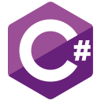
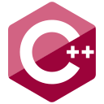

[< Back to profile](../README.md)

---

# Programming languages and related syntax

Programming languages that I used, and my opinions on them.
As well as some related formats.

Ranks:

- S - Pleasure to code
- A - Liked to work in it
- B - Wouldn't mind to use
- C - Can I use something better?
- D - I don't like it
- E - Never again
- F - What is this
- X - Weird/Special ones

Usage - first tried n years back / used for work projects n years (this doesn't mean I use it every day!)

---

| Icon | Language     | Rank | Usage  | My opinion |
|:----:|--------------|:----:|-------:|------------|
|  | C# | S    | 12 / 4 | Language I like ♥ to use the most. It can do almost anything these days. Only think that I wouldn't recommend it for, is dynamic types and handling of them. |
|  | TS | S    |  3 / 3 | The better version of JS. You will spend most time trying to match types instead of debugging. |
|  | JS | A    | 13 / 5 | Language that will haunt you in dreams. Manageable in small scale. |
|  | Python | A    |  5 / 0 | Machine learning, quick coding, research. Simple language that is best for working with data, but not the fastest. Also is simple to understand and rewrite to different one. |
|  | Markdown | A    |  7 / 5 | Best way to write documentations, topics, logs and many other things. But it lacks styling capabilities. |
|      | YAML         | A    |  4 / 3 | Best way for complex configurations. It's easier to read than JSON and doesn't require braces. |
|  | SCSS | A    |  4 / 5 | Advanced styles magic. |
|  | LESS | A    |  4 / 5 | Advanced styles magic, but less common. |
|      | JSON         | A    |  6 / 5 | The data format I like. Easy to read and write. |
|  | HTML | B    | 14 / 5 | The think that you will see everywhere. |
|    | CSS  | B    | 14 / 5 | Basic styles magic. |
|    | C++  | B    |  9 / 0 | Pointers, manual memory management and performance. When you need speed, this is the way to go. |
|    | SQL  | B    | 12 / 5 | The standard way to talk with databases. Sadly many of them have their own spinoffs of this. When you try more complex things, it's getting overcomplicated. |
|        | C    | C    | 14 / 0 | Good for HW, since is light, otherwise outdated. |
|      | CUDA         | C    |  2 / 0 | It looks scary, but is not that bad. Make your code works is harder in this case. |
|      | Batch        | C    | 15 / 5 | Simplest way to automate something on Windows. |
|      | Power shell  | C    | 13 / 5 | .Net in terminal basically. |
|      | Bash         | C    | 13 / 5 | Linux power ⚡. Better than Batch, but still overcomplicated. |
|      | XML          | C    | 13 / 5 | Data version of HTML, that is sometimes painful. Can we switch to JSON, is easier to parse/create. |
|      | Yolol        | D    |  2 / 0 | Used for in-game programming. Could be much better tho, more complex things are really hard to make. |
|      | PHP          | D    | 13 / 0 | We all started here, back in the days. But it requires way too much effort to get it to today security/performance standards. Unless someone really needs app specifically in this language, I would use newer one. |
|      | Visual Basic | D    | 13 / 0 | Older worse version of C#. Way to verbose in my opinion. |
|      | VBS          | D    | 15 / 0 | Alternative to batch scripts on Windows, that sometimes could do more. I'm still searching for use case of it, except of pranking someone. |
|      | LaTex        | D    |  4 / 0 | That painful language, you need to get CS degree, write some useful documentation or get rid of MS Word madness. |
|      | Java         | D    |  4 / 0 | Getter, setter hell and in some ways overcomplicated language. Was the go for multiplatform applications, but these days I would rather use modern ones. |
|      | OSTRAJava    | X    |  4 / 0 | More funny Czech version of Java. |
|      | Bainfuck     | X    |  8 / 0 | Best language you won't understand, but you could write an interpreter for. |
|      | Whitespace   | X    |  8 / 0 | Best language you can't read, but you could write an interpreter for. |

---

<h6 align="center">
    
 • &nbsp; [Profile](../README.md) &nbsp; •>
Languages <• &nbsp;
[Tech Stack](TechStack.md) &nbsp; • &nbsp;
[Software](Software.md) &nbsp; • &nbsp; 
[Operating Systems](Systems.md) &nbsp; • 
</h6>
<h6 align="center">
    
[< Back to profile](../README.md) &nbsp;&nbsp; • &nbsp;&nbsp; <b><a href="https://github.com/MGSE97" target="_blank">MGSE97</a> ☕ 2016 ... 2022</b> &nbsp;&nbsp; • &nbsp;&nbsp; [Tech Stack >](TechStack.md)
</h6>
