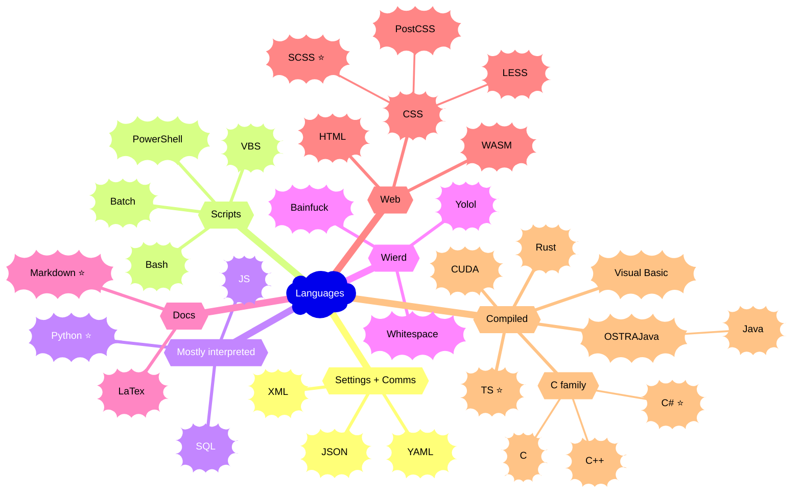

[< Back to profile](../README.md)

---

# Programming languages and related syntax

Programming languages that I used. Categories are very simplified, just for formating reasons.

I had worked mostly in C#, TS & JS and Python.

Legend:
 * ⭐ - That's good

---

<h6 align="center">
    
 • &nbsp; [Profile](../README.md) &nbsp;
 • &nbsp; [Tech Stack](TechStack.md) &nbsp;
 • &nbsp; [Concepts](Concepts.md) &nbsp;
 •>&nbsp; Languages &nbsp;<•
</h6>
<h6 align="center">
    
[< Concepts](Concepts.md)
&nbsp;&nbsp; • &nbsp;&nbsp;
<b><a href="https://github.com/MGSE97" target="_blank">MGSE97</a> ☕ 2016 ... 2023</b>
&nbsp;&nbsp; • &nbsp;&nbsp;
[Back to profile >](../README.md)
</h6>
