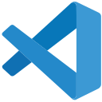
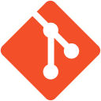

[< Back to profile](../README.md)

---

# IDE's, Editors and Tools

IDE's, editors and tools that I used, and my opinions on them.

Ranks:

- S - Pleasure to use
- A - Liked to work in it
- B - Wouldn't mind to use
- C - Can I use something better?
- D - I don't like it
- E - Never again
- F - What is this
- X - Weird/Special ones

---

| Icon[^1] | Tool / Version     | Rank | Usage    | My opinion |
|:----:|:-------------------|:----:|:--------:|------------|
|  | Visual Studio | B |||
|      | - 2010             | B    |          |            |
|      | - 2012             | B    |          |            |
|      | - 2015             | A    |          |            |
|      | - 2017             | A    |          |            |
|      | - 2019             | C    |          |            |
|      | - 2022             | S    |          |            |
|  | Visual Studio Code | A |||
|      | LINQPad            | S    |          |            |
|      | SSMS               | B    |          |            |
|  | Jetbrains | A |||
|      | - Resharper        | A    |          |            |
|      | - Rider            | B    |          |            |
|      | - Fleet            | C    |          |            |
|      | - IntelliJ IDEA    | B    |          |            |
|      | - Webstorm         | B    |          |            |
|      | - PyCharm          | B    |          |            |
|  | Git | S |||
|      | - GitHub           | S    |          |            |
|      | - GitLab           | A    |          |            |
|      | - BitBucket        | C    |          |            |

[^1]: Icons from [https://devicon.dev/](https://devicon.dev/)

---

<h6 align="center">
    
 • &nbsp; [Profile](../README.md) &nbsp; • &nbsp;
[Languages](Languages.md) &nbsp; • &nbsp;
[Tech Stack](TechStack.md) &nbsp; •>
Software <• &nbsp; 
[Operating Systems](Systems.md) &nbsp; • 
</h6>
<h6 align="center">
    
[< Tech Stack](TechStack.md) &nbsp;&nbsp; • &nbsp;&nbsp; 
<b><a href="https://github.com/MGSE97" target="_blank">MGSE97</a> ☕ 2016 ... 2022</b> &nbsp;&nbsp; • &nbsp;&nbsp; [Operating Systems >](Systems.md)
</h6>
