[< Back to profile](../README.md)

---

# Tech Stack

My Tech Stack technologies, frameworks, tools, IDE's and others, that I've used. I've kept bad ones of this map.

Legend:
 * 🧙‍ - Let's do some magic
 * ☕ - This need's a lot of coffe

## Frontend

I work mostly with websites.

```mermaid
mindmap
  root)Frontend(
       ))Mobile
           <br/>~~~~~~~~~~~~~~~<br/>
           Xamarin ☕<br/>
           Apache Cordova<br/>
           Tauri
       ((
       {{Web}}
        (UI
           <br/>~~~~~~~~~~~~~~~~~~<br/>
           ASP .NET<br/>
           ASP .NET Core 🧙‍<br/>
           Blazor ☕<br/>
           React 🧙‍<br/>
           Svelte<br/>
           Astro
        )
        (Styles
           <br/>~~~~~~~~~~~~~~<br/>
           Bootstrap ☕‍<br/>
           Material UI ☕‍<br/>
           Tailwind ☕‍<br/>
           LESS‍<br/>
           SASS‍<br/>
           PostCSS<br/>
           CSS
        )
        )) Interactivity
           <br/>~~~~~~~~~~~~~~~<br/>
           @include UI 🧙<br/>
           Knockout.js<br/>
           jQuery<br/>
        ((
        )) Editors
           <br/>~~~~~~~~~~~~~~~<br/>
           TinyMCE<br/>
           ToastUI
        ((
       ))Desktop
           <br/>~~~~~~~~~~~~~~~~~~~~~~~~<br/>
           Console: Cmd|Bash|ZSH|PS<br/>
           Windows Forms<br/>
           OpenGL
       ((
```

## Backend

I've worked in .NET ecosystem, now I'm focusing on Node ecosystem and Rust.

```mermaid
mindmap
  root)Backend(
     ))Framework
         <br/>~~~~~~~~~~~~~~~<br/>
         Node.js 🧙<br/>
         .NET Core 🧙<br/>
         .NET
     ((
     (Server
         <br/>~~~~~~~~~~~~~~~<br/>
         ASP .NET<br/>
         ASP .NET Core 🧙<br/>
         Express.js 🧙<br/>
         Axum ☕<br/>
         Async GraphQL ☕<br/>
         Apollo Server ☕
     )
     (ORM + Connectors
         <br/>~~~~~~~~~~~~~~~~~~~~~~~~~<br/>
         ADO .NET<br/>
         Entity Framework<br/>
         Entity Framework Core 🧙<br/>
         LINQ to DB "linq2db" 🧙<br/>
         Knex 🧙<br/>
         SQLX ☕
     )
     (Databases
         <br/>~~~~~~~~~~~~~~~<br/>
         SQL Server ☕<br/>
         Maria DB ☕<br/>
         MySQL<br/>
         Postgres ☕<br/>
         Firestore<br/>
         SQLite
     )
```

## Fun

I sometimes try something in free time, that involves GPU processing.

## System

Here are some of OS, IDE's and other tools, that I remembered of top of my head, and used them.

```mermaid
mindmap
  root)System(
    ))OS
        <br/>~~~~~~~~~~~~~<br/>
        Windows 🧙‍<br/>
        MacOS ☕<br/>
        Linux<br/>
        Android
    ((
    ))Cloud
        <br/>~~~~~~~~~~~~~~~~~~~~~~~<br/>
        Azure<br/>
        Google Cloud Platform ☕<br/>
        Firebase ☕
    ((
    {{IDE's}}
        ))Microsoft
            <br/>~~~~~~~~~~~~~~~~<br/>
            Visual Studio 🧙‍<br/>
            Visual Studio Code
        ((
        ))Jetbrains
            <br/>~~~~~~~~~~~~~~~~<br/>
            WebStorm 🧙‍<br/>
            PyCharm ☕<br/>
            Resharper<br/>
            IntelliJ IDEA
        ((
    {{Tools}}
        ))Git
            <br/>~~~~~~~~~~~<br/>
            GitHub 🧙‍<br/>
            GitLab ☕<br/>
            BitBucket
        ((
        ))Others
            <br/>~~~~~~~~~~~<br/>
            VSIX ☕<br/>
            LINQPad ☕<br/>
            SSMS <br/>
            Jupyter
        ((
```

---

<h6 align="center">
    
 • &nbsp; [Profile](../README.md) &nbsp;
 •>&nbsp; Tech Stack &nbsp;<•
   &nbsp; [Concepts](Concepts.md) &nbsp;
 • &nbsp; [Languages](Languages.md) &nbsp;
 • 
</h6>
<h6 align="center">
    
[< Back to profile](../README.md)
&nbsp;&nbsp; • &nbsp;&nbsp;
<b><a href="https://github.com/MGSE97" target="_blank">MGSE97</a> ☕ 2016 ... 2023</b>
&nbsp;&nbsp; • &nbsp;&nbsp;
[Concepts >](Concepts.md)
</h6>
